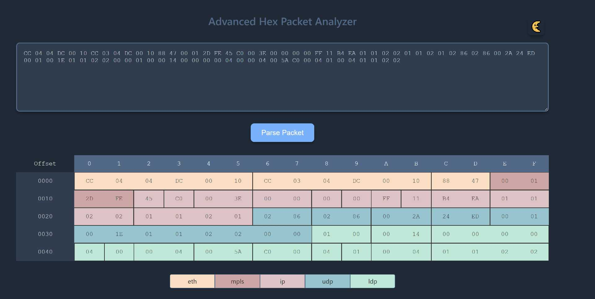

# advanced-hex-packet-analyzer
<p align="center">
  
</p>

[](https://github.com/masesk/advanced-hex-packet-analyzer/blob/master/LICENSE)
[](https://github.com/masesk/advanced-hex-packet-analyzer/stargazers)
[](https://github.com/masesk/advanced-hex-packet-analyzer/network/members)

## Docker (Recommended)

### Requirements
- Docker

### Build
```
docker build -t masesk/ahpa .
```

### Run
```
docker run -d --name ahpa masesk/ahpa -p 5000:5000 ahpa
```

## Local
### Requirements
- tshark
- python >= 3.6
- python-venv
- python-pip

### Setup
```
python3 -m venv .venv
```
```
. .venv/bin/activate
```
```
pip install -r requirements.txt
```

### Run
```
python app/app.py
```


## API

* **PDML** 
    * /parse_packet?packet=**<packet_in_hex>**

